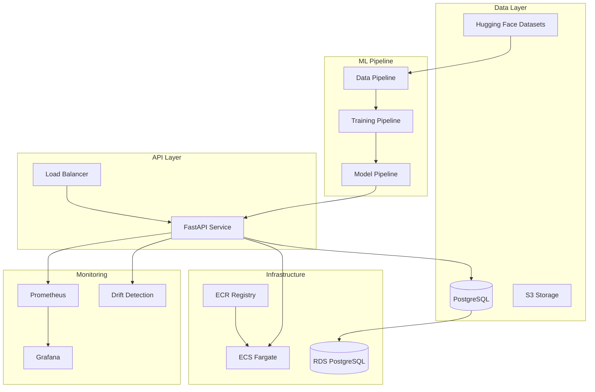

# ML Pipeline Architecture & Best Practices Implementation

## 🏗️ Architecture Overview

This project implements a production-ready, enterprise-grade ML pipeline for sentiment analysis using Hugging Face transformers. The architecture follows MLOps best practices with comprehensive security, monitoring, and scalability features.

### Core Components



## 🛡️ Security Improvements Implemented

### 1. SQL Injection Prevention
- **Issue**: Direct string interpolation in SQL queries
- **Solution**: Implemented table name validation with whitelist and regex patterns
- **Files**: `src/database/database.py`

```python
def _validate_table_name(self, table_name: str) -> str:
    # Regex validation for safe characters
    if not re.match(r'^[a-zA-Z_][a-zA-Z0-9_]*$', table_name):
        raise SecurityError(f"Invalid table name format: {table_name}")

    # Whitelist validation against known tables
    if table_name not in self._valid_table_names:
        raise SecurityError(f"Table name not allowed: {table_name}")
```

### 2. CORS Security
- **Issue**: Wildcard CORS policy allowing all origins
- **Solution**: Environment-based CORS configuration with specific allowed origins
- **Files**: `src/api/main.py`

### 3. Secrets Management
- **Issue**: Hardcoded database passwords and sensitive defaults
- **Solution**:
  - Removed default passwords from configuration
  - Environment-based secrets validation
  - AWS Secrets Manager integration in Terraform
- **Files**: `src/utils/config.py`, `docker-compose.yml`

### 4. Container Security
- **Issue**: Single-stage builds with unnecessary packages
- **Solution**: Multi-stage Docker builds with distroless approach
- **Files**: `docker/Dockerfile.api`

```dockerfile
# Multi-stage build with security best practices
FROM python:3.9-slim as builder
# ... build dependencies

FROM python:3.9-slim as production
# Runtime dependencies only
RUN groupadd -r -g 1000 appuser && useradd -r -u 1000 -g appuser -m -s /bin/false appuser
# ... minimal runtime setup
USER appuser
```

## 🧪 Testing Infrastructure

### Comprehensive Test Suite
- **Unit Tests**: `tests/unit/`
  - Configuration validation
  - Custom exception handling
  - Database security features
- **Integration Tests**: Planned in `tests/integration/`
- **End-to-End Tests**: Planned in `tests/e2e/`

### Test Configuration
- `pytest.ini` with coverage requirements (>80%)
- Mock fixtures for isolated testing
- CI/CD integration with automated testing

## 🔧 Error Handling & Resilience

### Custom Exception Hierarchy
```python
MLPipelineException (Base)
├── ConfigurationError
├── DatabaseError
├── ModelError
│   ├── PredictionError
│   └── TrainingError
├── SecurityError
├── ValidationError
└── MonitoringError
```

### Benefits
- Specific error types for targeted handling
- Structured error details for debugging
- Consistent error format across the application

## 📊 Monitoring & Observability

### Multi-Layer Monitoring
1. **Application Metrics**: Custom Prometheus metrics for predictions, errors, performance
2. **Infrastructure Metrics**: System resources, container health
3. **Business Metrics**: Model performance, data quality
4. **Security Metrics**: Failed authentication attempts, suspicious activities

### Drift Detection
- **Data Drift**: Statistical tests on input distributions
- **Concept Drift**: Confidence score analysis and prediction patterns
- **Model Drift**: Performance degradation over time

## 🚀 CI/CD Pipeline

### Automated Pipeline Stages
1. **Code Quality**: Linting, type checking, security scanning
2. **Testing**: Unit, integration, and performance tests
3. **Security**: Bandit, Safety, Semgrep, Trivy container scanning
4. **Build**: Multi-stage Docker builds with caching
5. **Deploy**: Environment-specific deployments with smoke tests

### Security Integration
- Automated vulnerability scanning
- SARIF report generation
- Security gate for deployment approval

## 🏗️ Infrastructure as Code

### Terraform Configuration
- **Network**: VPC with public/private subnets, security groups
- **Compute**: ECS Fargate with auto-scaling
- **Database**: RDS PostgreSQL with encryption and backups
- **Storage**: S3 with versioning and encryption
- **Monitoring**: CloudWatch logs and metrics
- **Security**: IAM roles with least-privilege access

### Key Security Features
```hcl
# Encrypted storage
resource "aws_db_instance" "postgres" {
  storage_encrypted = true
  # ... other config
}

# Private subnets for database
resource "aws_db_subnet_group" "main" {
  subnet_ids = module.vpc.private_subnets
}

# Security group with minimal access
resource "aws_security_group" "rds" {
  # Only allow access from ECS tasks
  ingress {
    from_port = 5432
    to_port = 5432
    protocol = "tcp"
    security_groups = [aws_security_group.ecs_tasks.id]
  }
}
```

## 🔄 MLOps Best Practices Implemented

### 1. Experiment Tracking
- MLflow integration for experiment management
- Automated metric logging and artifact storage
- Model versioning and lineage tracking

### 2. Model Serving
- FastAPI with automatic OpenAPI documentation
- Health checks and graceful shutdowns
- Request/response logging for audit trails

### 3. Data Pipeline
- Reproducible data processing with Hugging Face datasets
- Data quality validation and monitoring
- Version-controlled data transformations

### 4. Monitoring
- Real-time prediction monitoring
- Automated drift detection with alerts
- Performance metrics and SLA tracking

## 📈 Scalability Features

### Auto-Scaling
- ECS service auto-scaling based on CPU/memory
- Database connection pooling
- Load balancer with health checks

### Performance Optimization
- Multi-stage Docker builds for smaller images
- Connection pooling for database access
- Caching layers for frequent operations

## 🔒 Production Readiness Checklist

### ✅ Implemented
- [x] Security hardening (SQL injection, CORS, secrets)
- [x] Comprehensive error handling
- [x] Automated testing infrastructure
- [x] Container security best practices
- [x] Infrastructure as Code
- [x] CI/CD pipeline with security gates
- [x] Monitoring and alerting
- [x] Documentation and runbooks

### 🚧 Recommended Next Steps
- [ ] Add authentication/authorization (OAuth2/JWT)
- [ ] Implement rate limiting
- [ ] Add A/B testing framework
- [ ] Create disaster recovery procedures
- [ ] Add performance benchmarking
- [ ] Implement model A/B testing

## 🚀 Getting Started

### Local Development
```bash
# Clone repository
git clone <repo-url>
cd ml-pipeline-project

# Set environment variables
cp .env.example .env
# Edit .env with your configuration

# Start services
./scripts/start_services.sh

# Run tests
pytest tests/ -v --cov=src
```

### Production Deployment
```bash
# Deploy infrastructure
cd infrastructure
terraform init
terraform plan -var="environment=prod"
terraform apply

# Deploy application
git push origin main  # Triggers CI/CD pipeline
```

## 📚 Additional Documentation

- **API Documentation**: Available at `/docs` endpoint when running
- **Database Schema**: See `src/database/models.py`
- **Configuration**: See `src/utils/config.py`
- **Monitoring**: See `src/monitoring/` modules

## 🤝 Contributing

1. Follow the established code style (Black, isort, flake8)
2. Write tests for new functionality
3. Update documentation as needed
4. Security: Run security scans before committing
5. Performance: Consider impact on system performance

This architecture provides a solid foundation for production ML systems with enterprise-grade security, monitoring, and scalability features.