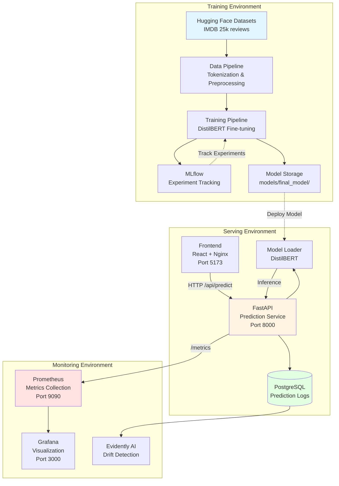
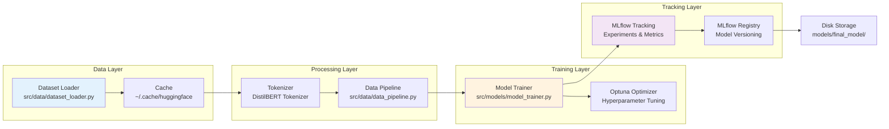
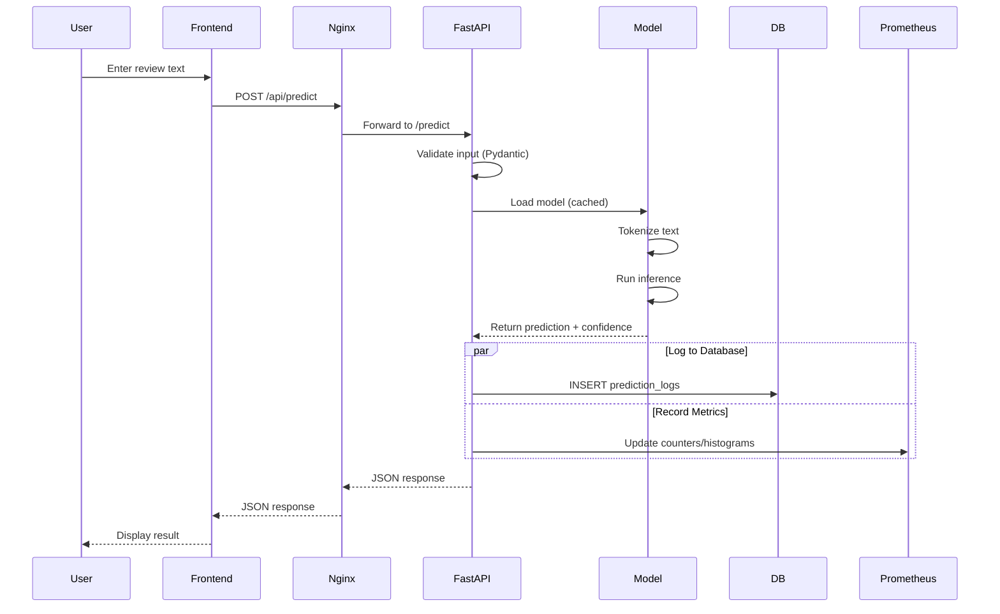
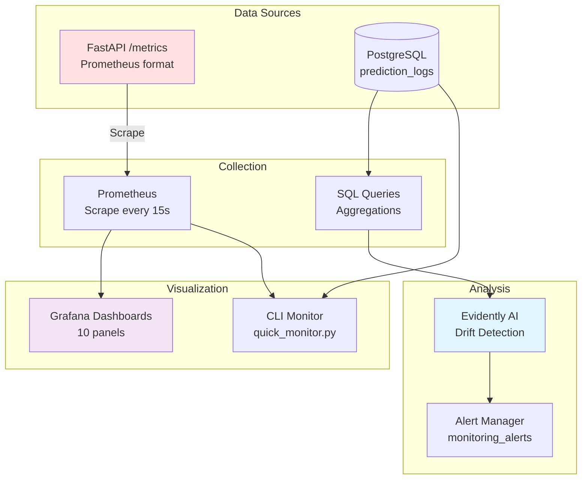
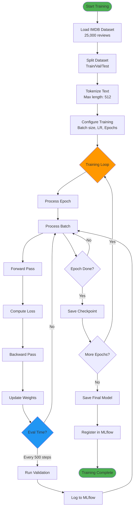
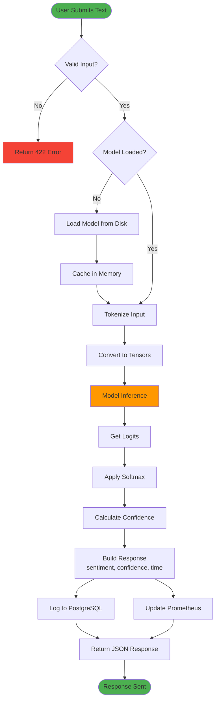
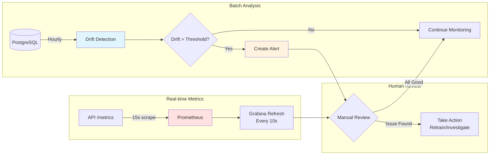
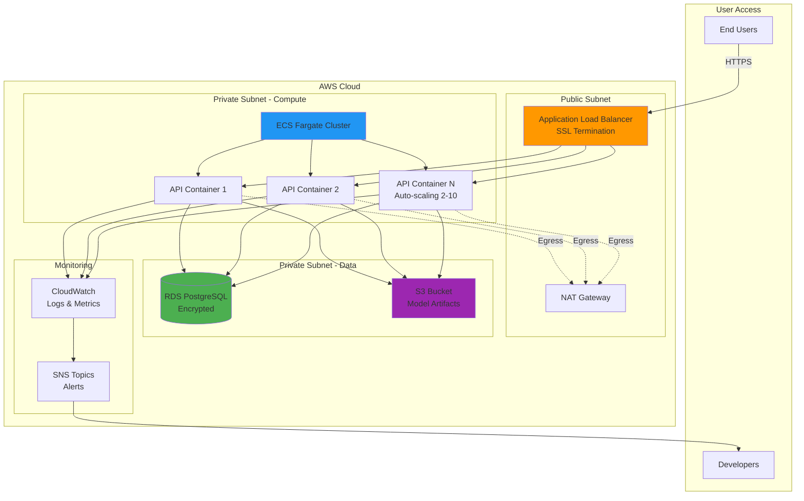
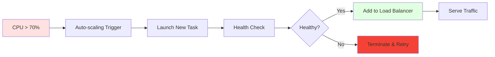

# ML Pipeline Development Guide

Complete developer guide for the ML Pipeline project covering architecture, design decisions, development workflows, and best practices.

---

## Table of Contents

1. [System Architecture](#system-architecture)
2. [Component Design](#component-design)
3. [Data Flow & Interaction](#data-flow--interaction)
4. [Development Environment](#development-environment)
5. [Core Development Workflows](#core-development-workflows)
6. [Technology Stack](#technology-stack)
7. [Design Decisions](#design-decisions)
8. [Database Architecture](#database-architecture)
9. [Security Architecture](#security-architecture)
10. [Testing Strategy](#testing-strategy)
11. [Performance & Scalability](#performance--scalability)

---

## System Architecture

### High-Level Architecture Overview

This ML pipeline implements a complete end-to-end MLOps system with three distinct environments: Training, Serving, and Monitoring.



**Architecture Principles:**

1. **Separation of Concerns**: Training, serving, and monitoring are independent
2. **Production-First**: Built for real-world deployment from day one
3. **Observability**: Every prediction logged and monitored
4. **Scalability**: Designed for horizontal scaling

---

## Component Design

### 1. Training Pipeline

The training pipeline handles model development and experimentation.



**Component Explanations:**

- **Dataset Loader**: Fetches IMDB dataset from Hugging Face, caches locally
- **Tokenizer**: Converts text to tokens using DistilBERT vocabulary (30,522 tokens)
- **Data Pipeline**: Handles batching, padding, and dataset splitting
- **Model Trainer**: Fine-tunes DistilBERT using Hugging Face Trainer API
- **Optuna Optimizer**: Searches hyperparameter space (learning rate, batch size, epochs)
- **MLflow Tracking**: Logs parameters, metrics, and artifacts for each run
- **MLflow Registry**: Versions models and tracks lineage

---

### 2. Serving Pipeline

The serving pipeline handles real-time predictions.



**Component Explanations:**

- **Frontend (React)**: User interface for sentiment analysis, served via Nginx on port 5173
- **Nginx Proxy**: Routes `/api/*` requests to FastAPI, serves static files
- **FastAPI**: REST API with automatic validation, documentation, and error handling
- **Model Loader**: Singleton pattern - loads model once, reuses for all predictions
- **Pydantic Validation**: Ensures input text is 1-5000 characters, JSON formatted
- **PostgreSQL Logging**: Records every prediction with metadata for audit and analysis
- **Prometheus Metrics**: Real-time counters and histograms for monitoring

---

### 3. Monitoring Pipeline

The monitoring pipeline tracks model performance and system health.



**Component Explanations:**

- **Prometheus Scraping**: Pulls metrics from `/metrics` endpoint every 15 seconds
- **Custom Metrics**: Counters (predictions), Histograms (latency, confidence), Gauges (model status)
- **Evidently AI**: Detects data drift (input distribution), concept drift (model behavior), performance drift
- **Alert Manager**: Stores alerts in database, can trigger notifications (Slack, email)
- **Grafana Dashboards**: Visual monitoring with 10 panels (sentiment distribution, latency, confidence)
- **CLI Monitor**: Quick snapshot for terminal-based monitoring

---

## Data Flow & Interaction

### Training Flow



**Explanation:**

1. **Data Loading**: Hugging Face datasets automatically caches data locally
2. **Tokenization**: Converts text to input IDs, attention masks, and labels
3. **Training Loop**: Standard PyTorch training with gradient accumulation
4. **Validation**: Every 500 steps, evaluate on validation set
5. **MLflow Logging**: Parameters, metrics, and model artifacts logged automatically
6. **Checkpointing**: Saves model at end of each epoch (checkpoint-313, checkpoint-626, etc.)

---

### Prediction Flow



**Explanation:**

1. **Input Validation**: Pydantic ensures text is not empty and within length limits
2. **Model Loading**: First request loads model, subsequent requests use cached version
3. **Tokenization**: Same tokenizer used in training, ensures consistency
4. **Inference**: Forward pass through model, typically 40-70ms
5. **Post-Processing**: Convert logits to probabilities, determine sentiment
6. **Logging**: Asynchronous writes to database and Prometheus to avoid blocking
7. **Response**: JSON with sentiment, confidence, probabilities, and timing

---

### Monitoring Flow



**Explanation:**

1. **Real-time Metrics**: Prometheus scrapes API metrics, Grafana visualizes
2. **Drift Detection**: Compares recent predictions to reference data from training
3. **Alert Generation**: Creates alert if drift score exceeds threshold (0.5)
4. **Human Review**: DevOps/ML engineers review dashboards and alerts
5. **Action**: Retrain model, adjust thresholds, or investigate data quality issues

### Deployment Architecture

Production deployment on AWS using Terraform-managed infrastructure.



**Deployment Components:**

- **Load Balancer**: Distributes traffic, SSL termination, health checks
- **ECS Fargate**: Serverless containers, auto-scaling based on CPU/memory
- **RDS PostgreSQL**: Managed database with automated backups, encryption at rest
- **S3**: Model artifact storage, versioned, lifecycle policies
- **CloudWatch**: Centralized logging, custom metrics, dashboards
- **SNS**: Alert notifications to Slack, email, PagerDuty
- **NAT Gateway**: Allows private subnet internet access (for Hugging Face downloads)

**Scaling Strategy:**



---

### Key Architectural Principles

**1. Separation of Concerns**
- Training uses MLflow for experiment tracking and versioning
- Serving uses saved model files (no MLflow dependency)
- API layer is completely independent of training infrastructure

**2. Production-First Design**
- Multi-stage Docker builds for security and size optimization
- Non-root container users
- Health checks with graceful degradation
- Comprehensive error handling with custom exception hierarchy

**3. Observability by Default**
- All predictions logged to PostgreSQL
- Prometheus metrics for API performance
- Drift detection with Evidently AI
- MLflow UI for experiment visualization

**4. Immutable Infrastructure**
- Container images are versioned and immutable
- Infrastructure defined as code (Terraform)
- Blue-green deployments for zero-downtime updates

**5. Defense in Depth Security**
- Network isolation (VPC, subnets, security groups)
- Application security (CORS, input validation, SQL injection prevention)
- Data security (encryption at rest and in transit)
- Container security (non-root users, minimal base images)

### Project Structure

```
ml-pipeline-project/
├── src/
│   ├── data/              # Data loading, preprocessing, tokenization
│   │   ├── data_pipeline.py       # End-to-end data pipeline
│   │   └── dataset_loader.py      # Hugging Face dataset integration
│   ├── models/            # Model training and inference
│   │   ├── model_trainer.py       # Training with MLflow tracking
│   │   └── training_pipeline.py   # Full training orchestration
│   ├── api/               # FastAPI REST API
│   │   ├── main.py                # API application and routes
│   │   ├── models.py              # Pydantic request/response models
│   │   ├── services.py            # Business logic services
│   │   └── prometheus_metrics.py  # Metrics instrumentation
│   ├── database/          # Database models and repositories
│   │   ├── models.py              # SQLAlchemy models
│   │   └── repositories.py        # Data access layer
│   ├── monitoring/        # Drift detection and alerting
│   │   ├── drift_detector.py      # Evidently AI integration
│   │   └── alerting.py            # Alert management
│   └── utils/             # Shared utilities
│       ├── config.py              # Environment configuration
│       ├── logger.py              # Logging setup
│       └── exceptions.py          # Custom exception hierarchy
├── infrastructure/        # Terraform AWS infrastructure
├── scripts/              # Development and monitoring scripts
├── tests/                # Unit and integration tests
├── docker/               # Dockerfiles
├── monitoring/           # Prometheus and Grafana configs
└── docs/                 # Documentation
```

---

## Development Environment

### Option 1: Dev Container (Recommended)

The project includes a VS Code dev container configuration for isolated development:

```bash
# Open in VS Code and select "Reopen in Container"
# All dependencies are automatically installed in a clean Python 3.12 environment
# Services automatically start on container launch
# Ports forwarded: 8000 (API), 5001 (MLflow), 5432 (PostgreSQL), 3000 (Grafana), 9090 (Prometheus)
```

### Option 2: Local Development

```bash
# Create virtual environment (recommended to avoid dependency conflicts)
python -m venv venv
source venv/bin/activate  # On Windows: venv\Scripts\activate

# Install dependencies
pip install -r requirements.txt
```

### Required Environment Variables

Create a `.env` file from `.env.example`:

```bash
# Database (no defaults - must be provided)
DB_HOST=localhost
DB_PORT=5432
DB_NAME=ml_pipeline
DB_USER=postgres
DB_PASSWORD=<required>

# MLflow
MLFLOW_TRACKING_URI=http://localhost:5001

# Model Configuration
MODEL_NAME=distilbert-base-uncased
MAX_LENGTH=512
NUM_LABELS=2

# API Configuration
API_PORT=8000
CORS_ORIGINS=http://localhost:3000,http://localhost:8000

# Training Configuration
BATCH_SIZE=16
LEARNING_RATE=2e-5
NUM_EPOCHS=3
```

---

## Core Development Workflows

### Training Pipeline

```bash
# Quick test run (1000 samples, 1 epoch, ~2-5 minutes)
python scripts/train_pipeline.py --quick

# Full training (25k samples, 3 epochs, ~30-60 minutes)
python scripts/train_pipeline.py

# Hyperparameter optimization
python scripts/train_pipeline.py --optimize --n-trials 20

# Custom configuration
python scripts/train_pipeline.py --dataset imdb --model bert-base-uncased
```

### Testing

```bash
# Run full test suite with coverage
pytest tests/ -v --cov=src --cov-report=html --cov-report=term-missing

# Run specific test types
pytest tests/unit/ -v          # Unit tests only
pytest tests/integration/ -v   # Integration tests only
pytest -m "not slow"           # Skip slow tests
pytest -m database            # Database-related tests only

# Run single test file/function
pytest tests/unit/test_config.py::test_config_validation -v
```

### Code Quality

```bash
# Format code
black src/ tests/ scripts/
isort src/ tests/ scripts/

# Lint code
flake8 src/ tests/ --max-line-length=100

# Type checking
mypy src/ --ignore-missing-imports --no-strict-optional
```

### Docker Services

```bash
# Start all services
docker-compose up -d

# Start specific services
docker-compose up -d postgres mlflow api

# Run training in container
docker-compose --profile training up training

# View logs
docker-compose logs -f api
docker-compose logs -f training

# Stop services (preserves data)
docker-compose stop

# Stop and remove everything
docker-compose down

# Stop and remove with volumes (WARNING: deletes data)
docker-compose down -v

# Check service status
docker-compose ps

# Health check
./scripts/check_services.sh
```

---

## Technology Stack

### Machine Learning
- **Model**: DistilBERT-base-uncased (Hugging Face Transformers)
- **Dataset**: IMDB movie reviews (25,000 training samples)
- **Framework**: PyTorch 2.8.0
- **Training**: Transformers Trainer with mixed precision
- **Optimization**: Optuna for hyperparameter search

### MLOps & Orchestration
- **Experiment Tracking**: MLflow 3.4.0
- **Model Registry**: MLflow Models
- **Hyperparameter Tuning**: Optuna 4.5.0
- **Data Versioning**: Hugging Face Datasets

### API & Backend
- **API Framework**: FastAPI 0.118.0
- **Validation**: Pydantic 2.11.9
- **ASGI Server**: Uvicorn with auto-reload
- **API Documentation**: OpenAPI (Swagger UI + ReDoc)

### Database & Storage
- **Database**: PostgreSQL 15
- **ORM**: SQLAlchemy 2.0.43
- **Migrations**: Alembic 1.16.5
- **Connection Pooling**: SQLAlchemy engine pooling

### Monitoring & Observability
- **Drift Detection**: Evidently AI 0.7.14
- **Metrics**: Prometheus 2.x with custom exporters
- **Visualization**: Grafana 10.x with pre-built dashboards
- **Logging**: Loguru with structured logging

### DevOps & Infrastructure
- **Containerization**: Docker 24.x, Docker Compose 3.8
- **CI/CD**: GitHub Actions
- **Infrastructure as Code**: Terraform (AWS provider)
- **Cloud Platform**: AWS (ECS Fargate, RDS, S3, CloudWatch)

---

## Design Decisions

### Why FastAPI?

**Decision**: Use FastAPI for the serving layer

**Rationale**:
- **Automatic OpenAPI documentation** - Essential for team collaboration
- **Type validation** - Pydantic models provide runtime validation
- **Performance** - ASGI-based, one of the fastest Python frameworks
- **Modern async support** - Ready for high-concurrency workloads
- **Developer experience** - Interactive docs at `/docs` endpoint

**Alternatives Considered**:
- Flask: More mature but slower, no async, manual validation
- Django: Too heavyweight for ML serving
- gRPC: Better performance but harder to debug

### Why DistilBERT?

**Decision**: Use DistilBERT as the default model

**Rationale**:
- **60% faster** than BERT with 97% of its accuracy
- **40% smaller** model size - critical for Docker images
- **Lower latency** - <100ms inference on CPU
- **Production-ready** - Battle-tested on millions of deployments

**Alternatives Considered**:
- BERT: Better accuracy but 2x slower
- RoBERTa: Marginal accuracy gains, significantly slower
- TinyBERT: Faster but accuracy drops too much (10-15%)

### MLflow: Training vs Serving

**Critical Distinction**: MLflow is ONLY used during training/experimentation - NOT during production serving.

#### During Training: MLflow's Four Roles

1. **Experiment Tracking** - Log hyperparameters and metrics
2. **Model Registry & Versioning** - Version control for models
3. **Hyperparameter Optimization Tracking** - Track Optuna trials
4. **Model Performance Over Time** - Historical performance trends

#### During Serving: Why MLflow is NOT Needed

Production inference flow:
```
User Request → FastAPI → Load model from disk → Inference → Log to PostgreSQL
```

**What API Actually Needs**:
1. Model files (saved during training)
2. Database connection (for logging predictions)
3. Environment config (.env file)

**Why This Design?**
- ✅ **Simpler deployment** - No MLflow server needed
- ✅ **Lower latency** - Direct model loading is faster
- ✅ **Fewer dependencies** - Reduces attack surface
- ✅ **Cost effective** - MLflow server costs money in cloud
- ✅ **Independence** - API works even if MLflow is down

---

## Database Architecture

### Schema Design

The database uses PostgreSQL with five core tables:

#### 1. prediction_logs

Tracks every prediction made by the API.

**Design Decisions**:
- **UUID for ID** - Distributed-system friendly
- **JSONB for probabilities** - Flexible schema, indexed queries
- **input_hash** - Enables deduplication and analysis
- **Nullable feedback fields** - Future-proofing for human-in-the-loop

**Key Indexes**:
```sql
CREATE INDEX idx_prediction_logs_predicted_at ON prediction_logs(predicted_at);
CREATE INDEX idx_prediction_logs_sentiment ON prediction_logs(predicted_sentiment);
CREATE INDEX idx_prediction_logs_deployment ON prediction_logs(deployment_id);
```

#### 2. model_deployments

Tracks which model versions are deployed.

**Design Decisions**:
- **deployment_type** - Supports A/B testing and canary deployments
- **model_metrics** - JSONB stores training results
- **is_active flag** - Soft deletes preserve history

#### 3. experiment_runs

Mirrors MLflow experiments for analytics.

#### 4. dataset_metrics

Tracks data quality and distribution over time.

#### 5. monitoring_alerts

Stores drift detection and anomaly alerts.

### Security Hardening

#### SQL Injection Prevention

Multi-layer validation:

```python
def _validate_table_name(self, table_name: str) -> str:
    # Layer 1: Regex validation
    if not re.match(r'^[a-zA-Z_][a-zA-Z0-9_]*$', table_name):
        raise SecurityError(f"Invalid table name format: {table_name}")

    # Layer 2: Whitelist validation
    valid_tables = {
        'prediction_logs',
        'model_deployments',
        'experiment_runs',
        'dataset_metrics',
        'monitoring_alerts'
    }
    if table_name not in valid_tables:
        raise SecurityError(f"Table name not allowed: {table_name}")

    return table_name
```

**Why Two Layers?**
- Regex catches injection attempts
- Whitelist ensures only known tables are accessed
- Defense in depth - both must pass

---

## Security Architecture

### Defense in Depth Strategy

#### 1. Application Layer Security

**CORS Configuration**:
```python
CORS_ORIGINS = os.getenv("CORS_ORIGINS", "").split(",")

app.add_middleware(
    CORSMiddleware,
    allow_origins=CORS_ORIGINS,  # No wildcards!
    allow_credentials=True,
    allow_methods=["GET", "POST"],
    allow_headers=["*"]
)
```

**Input Validation**:
```python
class PredictionRequest(BaseModel):
    text: str = Field(..., min_length=1, max_length=5000)
    return_probabilities: bool = False

    @validator('text')
    def validate_text(cls, v):
        if not v.strip():
            raise ValueError("Text cannot be empty")
        return v.strip()
```

#### 2. Container Security

**Multi-stage Docker Build**:
- Smaller final image (no build tools)
- Reduced attack surface
- Build cache optimization

**Non-root User**:
- Container breakout is less dangerous
- Follows principle of least privilege
- Kubernetes security policies require it

#### 3. Secrets Management

**Environment-based Secrets**:
```python
class Config:
    # NO DEFAULTS for sensitive values
    DB_PASSWORD: str = Field(..., env="DB_PASSWORD")  # Required!

    @validator("DB_PASSWORD")
    def validate_password(cls, v):
        if not v or v == "changeme":
            raise ValueError("DB_PASSWORD must be set to a secure value")
        return v
```

### Custom Exception Hierarchy

```python
class MLPipelineException(Exception):
    """Base exception for all ML pipeline errors"""
    pass

class ConfigurationError(MLPipelineException):
    """Configuration and environment issues"""
    pass

class SecurityError(MLPipelineException):
    """Security violations"""
    pass

class DatabaseError(MLPipelineException):
    """Database connectivity and query errors"""
    pass

class ModelError(MLPipelineException):
    """Model-related failures"""
    pass
```

**Why Custom Exceptions?**
- Specific error handling
- Better debugging
- Structured logging
- Client-friendly messages

---

## Testing Strategy

### Test Pyramid

```
        ╱╲
       ╱  ╲
      ╱ E2E ╲          ← Few (5-10 tests)
     ╱________╲
    ╱          ╲
   ╱Integration╲       ← Some (20-30 tests)
  ╱______________╲
 ╱                ╲
╱   Unit Tests     ╲   ← Many (50+ tests)
╱____________________╲
```

### Unit Tests (`tests/unit/`)

**Focus**: Isolated component testing with mocks

**Example**:
```python
def test_table_name_validation():
    """Test SQL injection prevention"""
    db = Database(mock_session)

    # Valid table name
    assert db._validate_table_name("prediction_logs") == "prediction_logs"

    # SQL injection attempts
    with pytest.raises(SecurityError):
        db._validate_table_name("users; DROP TABLE users--")
```

**Coverage Target**: 80% minimum (enforced in pytest.ini)

### Integration Tests (`tests/integration/`)

**Focus**: Component interaction and database operations

**Example**:
```python
@pytest.mark.integration
def test_prediction_logging(test_client, test_db):
    """Test predictions are logged to database"""
    response = test_client.post("/predict", json={
        "text": "Great movie!"
    })

    assert response.status_code == 200

    # Verify database log
    logs = test_db.query(PredictionLog).all()
    assert len(logs) == 1
    assert logs[0].input_text == "Great movie!"
```

### Test Configuration

**pytest.ini**:
```ini
[pytest]
testpaths = tests
addopts =
    --strict-markers
    --cov=src
    --cov-report=term-missing
    --cov-report=html
    --cov-fail-under=80

markers =
    slow: marks tests as slow
    integration: marks tests requiring database
    performance: marks performance/load tests
```

---

## Performance & Scalability

### Performance Optimization

#### 1. Model Optimization

**Choice of DistilBERT**:
- 40% smaller than BERT
- 60% faster inference
- Minimal accuracy loss (3%)

#### 2. Database Connection Pooling

```python
engine = create_engine(
    connection_string,
    pool_size=10,          # Connections kept open
    max_overflow=20,       # Additional connections under load
    pool_pre_ping=True,    # Validate before use
    pool_recycle=3600      # Recycle after 1 hour
)
```

**Why pooling?**
- Reuse connections (avoid TCP handshake overhead)
- Handle bursts (overflow connections)
- Automatic recovery (pre-ping validation)

#### 3. Caching Strategy

**Model caching** (in memory):
```python
class PredictionService:
    _model = None
    _tokenizer = None

    @classmethod
    def get_model(cls):
        if cls._model is None:
            cls._model = AutoModelForSequenceClassification.from_pretrained(
                "models/final_model"
            )
        return cls._model
```

### Scalability Design

#### Horizontal Scaling (ECS Fargate)

**Auto-scaling configuration**:
- Min capacity: 2 instances
- Max capacity: 10 instances
- Target CPU utilization: 70%

**Load balancing**:
- Application Load Balancer
- Health check endpoint: `/health`
- Automatic failover

---

## Summary

This development guide captures the key architectural decisions and their rationale:

1. **MLflow Separation** - Training tool only, not needed for serving
2. **Database-First Logging** - PostgreSQL for all predictions
3. **Security in Depth** - Multiple layers of protection
4. **Health Check Design** - Critical dependencies required
5. **Testing Strategy** - Pyramid approach with 80% coverage
6. **Performance Optimization** - Connection pooling, caching, model optimization
7. **Scalability Design** - Horizontal scaling with ECS

**Key Principle**: Every design decision prioritizes production readiness, security, and operational simplicity.

---

For monitoring and operational guides, see [docs/MONITORING.md](MONITORING.md).
